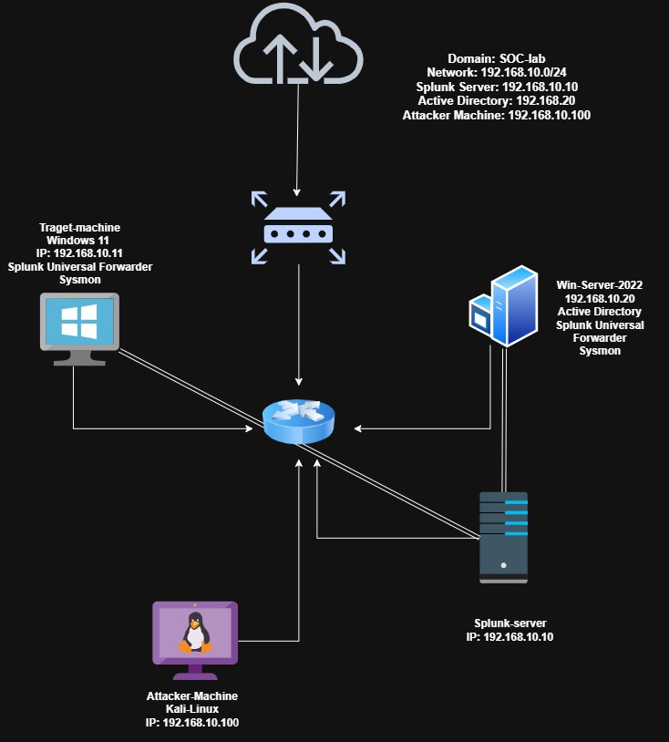

# SOC Home Lab: Active Directory + Splunk SIEM Detection Lab

## Overview

A self-built home lab simulating a small enterprise environment with **Active Directory, Splunk SIEM, Windows endpoints, and a Kali Linux attacker machine**.

The lab is designed to practice **log collection, SIEM monitoring, detection engineering, attack simulation, and incident investigation** from both the attacker and defender perspectives.

---

## Architecture

| Machine       | Role                                      | OS                  | IP               |
| ------------- | ----------------------------------------- | ------------------- | ---------------- |
| Splunk Server | SIEM / Log Indexer                        | Ubuntu Server       | `192.168.10.10`  |
| Win11         | Domain-joined workstation / attack target | Windows 11          | `192.168.10.11`  |
| Win22         | Domain Controller (`Myproject.local`)     | Windows Server 2022 | `192.168.10.12`  |
| Kali          | Attacker machine                          | Kali Linux          | `192.168.10.100` |



**Domain:** `Myproject.local`
**Organizational Units:** `IT`, `HR`

---

## Tools Used

* **Splunk Enterprise** — SIEM, log indexing and investigation
* **Splunk Universal Forwarder** — Windows log collection
* **Sysmon** — Windows process and network telemetry
* **Active Directory Domain Services** — Windows Server 2022
* **Kali Linux** — Hydra, Metasploit, Nmap, xfreerdp and other controlled attack tools
* **VirtualBox** — isolated NAT Network for lab infrastructure

---

## Attacks Documented

| #  | Attack                                     | Technique                          | Detection Focus                                     | Link                                                                              |
| -- | ------------------------------------------ | ---------------------------------- | --------------------------------------------------- | --------------------------------------------------------------------------------- |
| 01 | RDP Brute Force                            | Credential Access — T1110.001      | Failed and successful logon correlation             | [View Attack 01](attacks/01-rdp-bruteforce/README.md)                             |
| 02 | Malware Delivery & Reverse Shell Detection | User Execution / Command & Control | Process creation and network connection correlation | [View Attack 02](attacks/02-malware-delivery%26reverse-shell-detection/README.md) |
| 03 | Coming Soon                                | —                                  | —                                                   | —                                                                                 |

---

## Setup Summary

1. Built a NAT Network in VirtualBox for `192.168.10.0/24`.
2. Assigned static IP addresses to the lab machines.
3. Installed and configured Splunk on Ubuntu Server.
4. Deployed Splunk Universal Forwarder to Windows 11 and Windows Server 2022.
5. Configured Sysmon for Windows endpoint telemetry.
6. Promoted Windows Server 2022 to a Domain Controller for `Myproject.local`.
7. Created `IT` and `HR` Organizational Units.
8. Domain-joined Windows 11.
9. Configured Kali Linux as the attacker machine.
10. Created and investigated controlled attack scenarios using Splunk.

---

## Infrastructure Challenges & Troubleshooting

### Splunk Log Collection Issues

Investigated missing events from the Domain Controller by checking:

* Splunk Universal Forwarder service status
* Windows firewall and network profile
* `inputs.conf` monitoring configuration
* Network connectivity between the forwarder and Splunk server

### Event Time / Time Range Issues

Investigated events that were visible under **All Time** but missing from shorter time ranges.

The issue was traced to clock drift caused by inactive `systemd-timesyncd` on the Ubuntu server and time synchronization differences between the Linux and Windows systems.

The issue was resolved using:

```bash
timedatectl set-ntp true
```

and:

```cmd
w32tm /resync /force
```

This restored consistent timestamps across the lab environment and improved event correlation.

---

## Skills Demonstrated

* SIEM deployment and configuration
* Splunk log analysis
* SPL query development
* Windows Security Event analysis
* Sysmon telemetry analysis
* Active Directory administration
* Attack simulation in an isolated environment
* Threat detection and incident investigation
* MITRE ATT&CK mapping
* Process and network event correlation
* DNS, firewall and network troubleshooting
* NTP/time synchronization troubleshooting
* End-to-end incident reconstruction from raw logs

---

## Repository Structure

```text
soc-home-lab/
├── README.md
├── diagrams/
│   ├── network-architecture.drawio
│   └── Diagram.jpg
│
└── attacks/
    ├── 01-rdp-bruteforce/
    │   ├── README.md
    │   └── screenshots/
    │
    ├── 02-malware-delivery&reverse-shell-detection/
    │   ├── README.md
    │   └── screenshots/
    │
    ├── 03-coming-soon/
   
```

---

## Notes

This lab was built entirely within an **isolated VirtualBox NAT Network** with no intentional internet-facing exposure.

All attack activity was performed against the user's own lab systems and remained contained within the private `192.168.10.0/24` subnet.

The project is continuously being expanded with additional attack simulations and detection scenarios.

---

## Project Goals

The long-term goal of this lab is to build and document **five realistic SOC investigation scenarios**, covering different areas of the MITRE ATT&CK framework.

Each attack follows the same workflow:

```text
Attack Simulation
       ↓
Windows / Network Telemetry
       ↓
Log Collection
       ↓
Splunk Investigation
       ↓
Event Correlation
       ↓
Detection
       ↓
MITRE ATT&CK Mapping
       ↓
Lessons Learned & Recommendations
```
